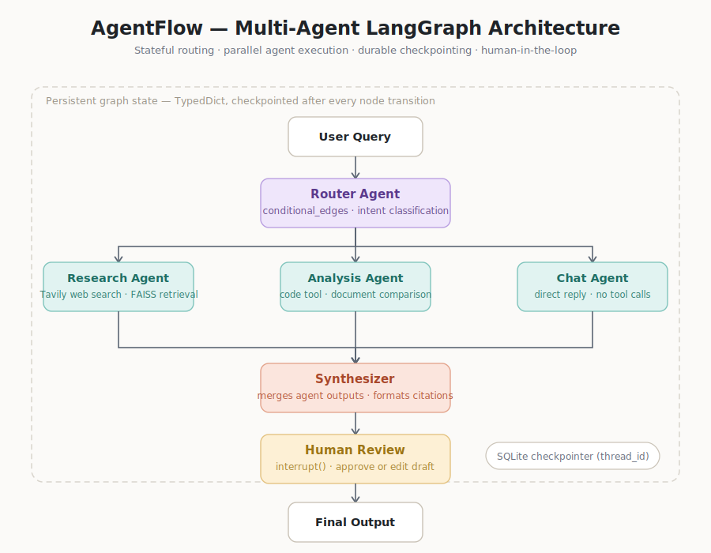

<div align="center">

# AgentFlow

**A production-grade multi-agent knowledge assistant built on LangGraph**

[](https://python.org)
[](https://langchain-ai.github.io/langgraph/)
[](https://fastapi.tiangolo.com)
[](https://react.dev)
[](LICENSE)

Stateful graph routing · Parallel agent execution · Durable checkpointing · Human-in-the-loop review · RAG over uploaded PDFs · Token streaming

</div>

---

## What is AgentFlow?

AgentFlow is a full-stack multi-agent system that demonstrates every skill that separates an AI engineer who can build *production* agentic pipelines from one who wraps a single LLM call in a UI:

- **Conditional routing** — an LLM classifies every query and dispatches it to the right specialist agent, not a hardcoded keyword switch
- **Multi-agent coordination** — three independent agent nodes (Research, Analysis, Chat), a Synthesizer, and a Human Review checkpoint, all wired into a single LangGraph `StateGraph`
- **Durable persistence** — every node transition is checkpointed to SQLite via `SqliteSaver`/`AsyncSqliteSaver`; sessions survive backend restarts
- **Retrieval-augmented generation** — PDF upload → recursive chunking → local sentence-transformer embeddings → per-thread FAISS index → cited retrieval
- **Human-in-the-loop** — LangGraph `interrupt()` pauses execution so a human can approve or edit the draft before it reaches the user
- **Real-time streaming** — FastAPI `StreamingResponse` wraps `astream_events` for token-level delivery to the React frontend

---

## Architecture



| Node | Model | Role |
|---|---|---|
| **Router** | `llama-3.3-70b-versatile` | Few-shot intent classification → routes to one of three agents |
| **Research Agent** | `llama-3.1-8b-instant` | ReAct loop: Tavily web search + per-thread FAISS retrieval |
| **Analysis Agent** | `llama-3.1-8b-instant` | ReAct loop: sandboxed AST calculator + FAISS retrieval |
| **Chat Agent** | `llama-3.1-8b-instant` | RAG-aware fast path — skips the Synthesizer for low-latency replies |
| **Synthesizer** | `llama-3.3-70b-versatile` | Polishes raw agent output into a clean, cited final response |
| **Human Review** | — | `interrupt()` gate — pauses execution for human approve / edit |

All seven nodes share a single `AgentState` TypedDict. Every transition is checkpointed to SQLite so the graph can be paused, resumed, or replayed from any prior state.

---

## Features

| Feature | Implementation |
|---|---|
| **Intent router** | `llama-3.3-70b` with a few-shot system prompt; falls back to `chat` on any LLM error |
| **Research agent** | ReAct loop with `tavily_search` + per-thread `retrieve_documents` |
| **Analysis agent** | ReAct loop with sandboxed AST calculator + per-thread `retrieve_documents` |
| **Chat agent** | ReAct loop, RAG-aware, skips the synthesizer for low-latency replies |
| **Synthesizer** | `llama-3.3-70b` polishes raw agent output into a clean cited final response |
| **Human review** | LangGraph `interrupt()` / `Command(resume=...)` with approve/edit contract |
| **Durable state** | `SqliteSaver` (sync tests) + `AsyncSqliteSaver` (FastAPI server) keyed by `thread_id` |
| **RAG pipeline** | `PyPDFLoader` → `RecursiveCharacterTextSplitter(800, 150)` → `all-MiniLM-L6-v2` → FAISS |
| **Streaming** | `astream_events(version="v2")` filtered to `on_chat_model_stream`, piped as SSE |
| **Security** | `<<UNTRUSTED …>>` prompt injection barriers; AST-validated calculator; optional bearer-token API key |
| **LLM fallback** | Up to 3 Groq keys in `RunnableWithFallbacks` chain + Gemini 2.0 Flash as last resort |
| **Agent cache** | LRU-128 `OrderedDict` per `(tool names, model, prompt hash, thread_id)` avoids redundant `create_react_agent` compiles |

---

## Quick Start

### Prerequisites

| Tool | Version | Where to get it |
|---|---|---|
| Python | 3.11+ | [python.org](https://python.org) |
| Node.js | 18+ | [nodejs.org](https://nodejs.org) |
| Groq API key | free | [console.groq.com](https://console.groq.com) |
| Tavily API key | free (1 000 searches/mo) | [tavily.com](https://tavily.com) |
| Google AI Studio key *(optional)* | free (1 M tokens/day) | [aistudio.google.com](https://aistudio.google.com) |

### 1 — Clone and install Python deps

```bash
git clone https://github.com/thenithin342/agentflow.git
cd agentflow

python -m venv venv
# Windows
venv\Scripts\activate
# macOS / Linux
source venv/bin/activate

pip install -r requirements.txt
```

### 2 — Configure environment variables

```bash
cp .env.example .env
```

Open `.env` and fill in your keys:

```env
# Required
GROQ_API_KEY=gsk_...
TAVILY_API_KEY=tvly-...

# Optional — enables Gemini fallback when Groq rate-limits
GOOGLE_API_KEY=AIza...

# Optional — rotate across up to 3 Groq keys for higher TPM
GROQ_API_KEY_2=gsk_...
GROQ_API_KEY_3=gsk_...

# Defaults — no changes needed for local dev
CHECKPOINT_DB_PATH=agentflow.db
LANGCHAIN_TRACING_V2=false
```

> `.env` is listed in `.gitignore`. **Never commit it.**

### 3 — Start the backend

```bash
uvicorn backend.main:app --reload --port 8000
```

The server logs confirm the graph compiled and the embedding model loaded:

```
[AgentFlow] graph compiled OK; async checkpointer on agentflow.db
```

### 4 — Start the frontend

```bash
cd frontend
npm install
npm run dev
```

Open [http://localhost:5173](http://localhost:5173) — the Vite dev server proxies `/chat`, `/upload`, and `/review` requests to port 8000 automatically.

### 5 — Run the test suite

```bash
# from the repo root, venv active
pytest tests/ -v
```

---

## API Reference

All endpoints accept and return JSON. Streaming responses use Server-Sent Events (SSE).

### `POST /chat`

Stream a response for a given conversation thread.

**Request body**

```json
{
  "thread_id": "my-session-abc123",
  "message": "What are the latest LLM benchmark results?",
  "review_required": false
}
```

| Field | Type | Description |
|---|---|---|
| `thread_id` | `string` | Stable ID scoping the conversation; alphanumeric + `-_` |
| `message` | `string` | User message, max 16 000 characters |
| `review_required` | `bool` | When `true`, graph pauses at Human Review for approval |

**Response** — SSE stream of JSON objects:

```jsonc
// Agent trace event
{"type": "trace", "node": "research_agent", "status": "started"}

// Token chunk
{"type": "token", "content": "The latest benchmark..."}

// Interrupt — requires /review
{"type": "interrupt", "draft": "Here is the draft response..."}

// Stream complete
{"type": "done", "final_response": "...", "sources": ["https://..."], "route": "research"}
```

---

### `POST /upload`

Ingest a PDF into the thread's FAISS vector index.

**Request** — `multipart/form-data`

| Field | Type | Description |
|---|---|---|
| `file` | `file` | PDF file, max 50 MB |
| `thread_id` | `string` | Thread to scope the index to |

**Response**

```json
{
  "document_id": "report.pdf:42",
  "source": "report.pdf",
  "pages": 8,
  "chunks": 42
}
```

---

### `GET /threads/{thread_id}/state`

Fetch the current graph state snapshot for a thread (useful for debugging or resuming).

**Response** — the serialised `AgentState` dict plus checkpoint metadata.

---

### `POST /review/{thread_id}`

Resume a paused graph after a Human Review interrupt.

**Request body**

```json
{ "action": "approve" }
```

```json
{ "action": "edit", "edited_response": "Here is my improved version..." }
```

| Field | Description |
|---|---|
| `action` | `"approve"` keeps the existing draft; `"edit"` replaces it |
| `edited_response` | Required when `action` is `"edit"` |

---

### `GET /health`

Liveness probe — always returns `{"status": "ok"}`. No auth required.

---

## Project Structure

```
agentflow/
│
├── backend/
│   ├── main.py              # FastAPI app — lifespan, endpoints, SSE streaming
│   ├── llm.py               # Lazy LLM singletons; 3-key Groq pool + Gemini fallback
│   ├── constants.py         # Upload/message limits; SSE node sets
│   ├── validation.py        # thread_id regex + validator
│   │
│   ├── graph/
│   │   ├── state.py         # AgentState TypedDict (messages, route, agent_output, …)
│   │   ├── router.py        # router_node + route_query conditional edge
│   │   ├── agents.py        # research / analysis / chat agent nodes; LRU agent cache
│   │   ├── tools.py         # tavily_search, AST calculator, make_retrieve_documents_tool
│   │   ├── synthesizer.py   # synthesizer_node; prompt-injection barriers
│   │   ├── human_review.py  # human_review_node; interrupt() / Command(resume=...)
│   │   ├── build_graph.py   # StateGraph topology; build_compiled_graph(); lazy proxy
│   │   ├── messages.py      # content_to_str helper
│   │   └── security.py      # escape_untrusted helper
│   │
│   └── rag/
│       └── ingest.py        # ingest_pdf() + get_retriever(); per-thread FAISS + LRU cache
│
├── frontend/
│   └── src/
│       ├── App.jsx          # Chat UI — SSE streaming, PDF upload, review panel, agent badges
│       ├── sseParser.js     # SSE payload parser
│       ├── constants.js     # Shared limits (mirrors backend/constants.py)
│       ├── ErrorBoundary.jsx
│       ├── index.css        # Design tokens + layout
│       └── main.jsx
│
├── tests/
│   ├── conftest.py          # Fixtures; thread_id injection; rate-limit xfail guard
│   ├── test_graph.py        # End-to-end graph tests (router, agents, synthesizer, HITL)
│   ├── test_api.py          # FastAPI endpoint tests (httpx AsyncClient)
│   ├── test_router.py       # Router unit tests — 20+ labelled classification examples
│   ├── test_tools.py        # Calculator unit tests
│   ├── test_messages.py     # content_to_str unit tests
│   └── sample.pdf           # Fixture PDF for upload / RAG tests
│
├── faiss_indexes/           # Per-thread FAISS indexes (git-ignored)
├── agentflow.db             # SQLite checkpoint store (git-ignored)
├── .env.example             # Environment variable template
├── requirements.txt         # Production deps
├── requirements-dev.txt     # Test-only deps (pytest, pytest-asyncio, httpx)
└── pytest.ini
```

---

## Tech Stack

| Layer | Choice | Notes |
|---|---|---|
| **Orchestration** | LangGraph 1.x + LangChain 0.3 | `StateGraph`, conditional edges, `interrupt`, `AsyncSqliteSaver` |
| **Smart LLM** | Groq `llama-3.3-70b-versatile` | Router + Synthesizer — quality gate |
| **Fast LLM** | Groq `llama-3.1-8b-instant` | Agent tool-calling — 30 K TPM free tier |
| **LLM fallback** | Google Gemini 2.0 Flash | 1 M tokens/day; appended as last fallback |
| **Local LLM** | Ollama + Qwen3-8B *(optional)* | Fully offline dev, zero API cost |
| **Web search** | Tavily (`langchain-tavily`) | Purpose-built for LLM agents; 1 000 searches/mo free |
| **Calculator** | Custom AST evaluator | Rejects names/calls/attributes; caps expression length, depth, exponents |
| **Vector store** | FAISS `faiss-cpu` | Local, no hosted service; per-thread isolation |
| **Embeddings** | `all-MiniLM-L6-v2` (HuggingFace) | Runs locally — avoids API quota burn on embedding calls |
| **Persistence** | SQLite (`SqliteSaver` / `AsyncSqliteSaver`) | Zero-setup; `PostgresSaver` documented as upgrade path |
| **Backend** | FastAPI 0.115 + Uvicorn | Async; `StreamingResponse` + `astream_events` for SSE |
| **Frontend** | React 18 + Vite 5 + Tailwind CSS | `react-markdown`, `react-syntax-highlighter`, SSE streaming reader |
| **Config** | `python-dotenv` | `.env` file; never committed |
| **Testing** | pytest + pytest-asyncio + httpx | Node-level, graph-level, and full API tests |

> **Cost:** every component above runs on a free tier or local compute. There are no required paid services.

---

## Build Phases

The project is built in 8 incremental phases. Each phase proves the previous one's wiring before adding complexity — never skip ahead.

| # | What gets built | Status |
|---|---|---|
| 1 | Single-node graph skeleton compiles and runs | ✅ Complete |
| 2 | Router classifies queries via conditional edges | ✅ Complete |
| 3 | Research / Analysis / Chat agent nodes with tools | ✅ Complete |
| 4 | SQLite checkpointer — state persists across restarts | ✅ Complete |
| 5 | Synthesizer merges agent output into final response | ✅ Complete |
| 6 | Human-in-the-loop review via `interrupt()` | ✅ Complete |
| 7 | RAG pipeline — PDF upload, FAISS retrieval | ✅ Complete |
| 8 | FastAPI streaming backend + React frontend | ✅ Complete |

---

## Testing

```bash
# Full suite
pytest tests/ -v

# Single test file
pytest tests/test_graph.py -v

# With coverage
pytest tests/ --cov=backend --cov-report=term-missing
```

**Test categories**

| File | What it covers |
|---|---|
| `test_router.py` | 20+ labelled classification examples to catch routing drift |
| `test_tools.py` | Calculator boundary conditions — overflow, depth, syntax errors |
| `test_messages.py` | `content_to_str` for all message content variants |
| `test_graph.py` | Full graph — research, analysis, chat, human-review interrupt, multi-turn memory |
| `test_api.py` | FastAPI endpoints — `/chat` streaming, `/upload`, `/review`, `/health` |

**Note on rate limits.** The Groq free tier is capped at 100 K tokens/day. Tests that hit this cap are automatically marked `xfail` by the `_rate_limit_guard` autouse fixture — the suite shows `x` instead of `FAILED`.

---

## Configuration Reference

| Variable | Default | Required | Description |
|---|---|---|---|
| `GROQ_API_KEY` | — | **Yes** | Primary Groq API key |
| `GROQ_API_KEY_2` | — | No | Secondary Groq key (rate-limit fallback) |
| `GROQ_API_KEY_3` | — | No | Tertiary Groq key |
| `TAVILY_API_KEY` | — | **Yes** | Tavily search API key |
| `GOOGLE_API_KEY` | — | No | Google AI Studio key (Gemini fallback) |
| `CHECKPOINT_DB_PATH` | `agentflow.db` | No | SQLite checkpoint file path |
| `CORS_ORIGINS` | `http://localhost:5173` | No | Comma-separated allowed origins |
| `AGENTFLOW_API_KEY` | — | No | Bearer token for optional API auth |
| `LANGCHAIN_TRACING_V2` | `false` | No | Enable LangSmith tracing |
| `LANGCHAIN_API_KEY` | — | No | LangSmith API key |

---

## Security Notes

- **Prompt injection** — user queries and agent outputs are wrapped in `<<UNTRUSTED …>>` / `<<END …>>` delimiters before being interpolated into synthesizer prompts. The system prompt instructs the model to treat everything inside as raw data.
- **Calculator** — expressions are parsed with `ast.parse(mode="eval")` and evaluated against a strict whitelist of numeric constants and arithmetic operators. Names, function calls, and attribute access all raise `ValueError`. Expression length, AST node count, exponent magnitude, and base magnitude are all capped.
- **File uploads** — rejected above 50 MB at the HTTP header level (before the body is buffered). `thread_id` values are validated against `^[a-zA-Z0-9_-]{1,128}$` on every endpoint.
- **API key auth** — optional; when `AGENTFLOW_API_KEY` is set, all routes except `/health` require `Authorization: Bearer <key>` or `X-API-Key: <key>`.

---

## Future Extensions

- **Parallel multi-agent dispatch** — fan out to multiple agents simultaneously for compound queries (e.g., *"research X and calculate Y"*), re-joining at the Synthesizer via LangGraph fan-out edges
- **PostgreSQL checkpointer** — swap `SqliteSaver` for `PostgresSaver` for true concurrent multi-user write durability
- **Memory summarization** — compress old conversation turns once `messages` exceeds a token budget to avoid naive truncation
- **Streaming agent badges** — push routing decisions to the frontend in real-time as graph execution progresses

---

## License

MIT — see [LICENSE](LICENSE) for details.

---

<div align="center">

Built by **Nithin** · Portfolio project demonstrating production agentic AI system design

</div>
